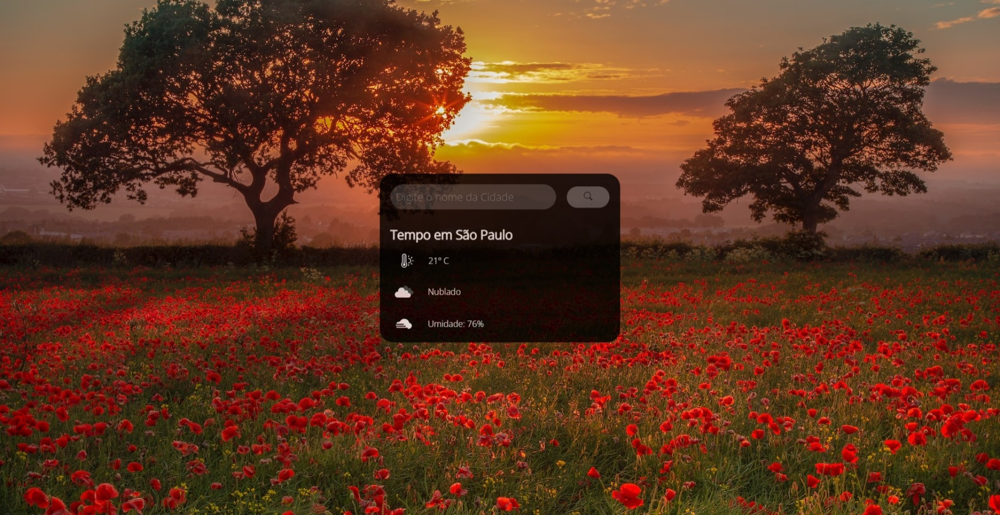

# Previsão do Tempo
- Previsão do tempo da cidade que você deseja!
  
## Sobre o Projeto

- Com ajuda de uma **API** que pega o **tempo real das cidades**, esse projeto é um site que mostra a **previsão do tempo** de acordo com a **cidade que você pesquisar**.

## Linguagens

- HTML
- CSS
- JavaScript

## Como testar

- **1.** clone este repositório;
- **2.** Abra com VsCode;
- **3.** Acesse a pasta **clima** e execute o index.html via Live Server.

# Prints das Telas

## Tela inicial:

## Tela resultado:

